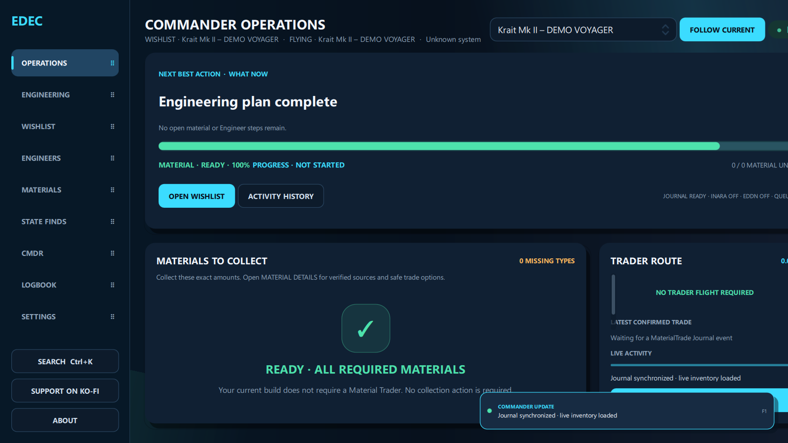
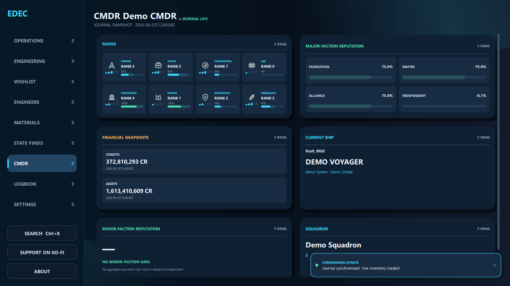
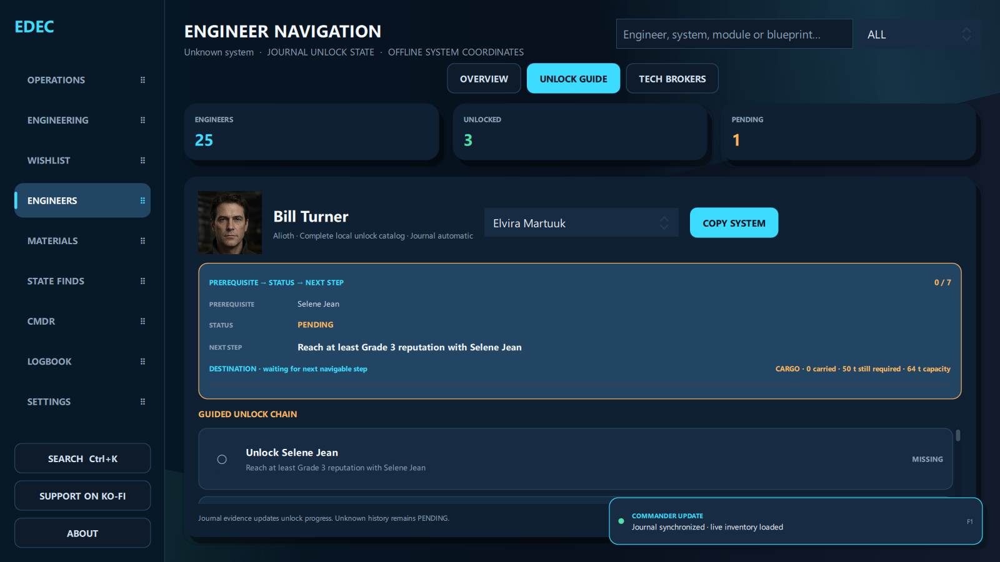

# ED Engineering Companion (EDEC)

ED Engineering Companion (EDEC) is a free, open-source companion tool for Elite Dangerous. It combines blueprint planning, material tracking, Engineer unlock guidance, Journal processing, and optional INARA/EDDN connectivity in one desktop application.

[Download the latest release](https://github.com/CMDRForcer/ED-Engineering-Companion/releases/latest) · User manual: [English](docs/EDEC_User_Manual_Privacy_EN_21.163.pdf) / [Deutsch](docs/EDEC_User_Manual_Privacy_DE_21.163.pdf) · [Report a bug](https://github.com/CMDRForcer/ED-Engineering-Companion/issues) · [Support EDEC on Ko-fi](https://ko-fi.com/cmdrforcer)



## Features

- Blueprint, engineering, and wishlist planning
- Live raw, manufactured, and encoded material inventory
- Material farming guidance and trader-route support
- Engineer Unlock Guide and Technology Broker tracking
- CMDR overview with ranks, reputation, finances, ship, and squadron
- Logbook, session history, and personal notes
- Automatic, rate-limited INARA synchronization
- EDDN contributions for market, outfitting, shipyard, exploration, and exobiology data
- Offline-aware handling for INARA, EDDN, and Spansh
- Customizable navigation and CMDR card ordering

## Screenshots

### CMDR overview



### Engineer Unlock Guide



All screenshots use synthetic demo data and do not contain a real Commander profile or API credentials.

## Download and install on Windows

### Requirements

- Windows 10 or Windows 11
- Elite Dangerous Journal files for live Commander data

### Portable installation (recommended)

1. Open the [latest EDEC release](https://github.com/CMDRForcer/ED-Engineering-Companion/releases/latest).
2. Under **Assets**, download `EDEC-21.163-Windows.zip`.
3. Extract the entire ZIP to a writable folder.
4. Start `EDEC.exe`. Keep the `_internal` folder next to the executable.

The portable package includes Python and all required dependencies. Windows SmartScreen may show a warning because the executable is not code-signed yet.

### Run from source

To run the source version instead, install Python 3, download **Source code (zip)**, extract it, run `INSTALL_REQUIREMENTS.bat` once, and then start EDEC with `START_APP.bat`.

Personal settings, Journal cursors, caches, and service credentials are stored outside the program folder and are not part of the GitHub download.

## User manual and privacy

The illustrated EDEC 21.163 manual explains installation, navigation, Engineering, the Unlock Guide, local data storage, and the complete INARA, EDDN, and Spansh data flows. It is available in [English](docs/EDEC_User_Manual_Privacy_EN_21.163.pdf) and [German](docs/EDEC_User_Manual_Privacy_DE_21.163.pdf). Both editions use synthetic demo screenshots throughout.

## Connections

### INARA

INARA synchronization is optional. EDEC batches supported Commander events, applies deduplication, respects rate limits, and stores local receipts. An INARA API key and Commander configuration are required before uploads can be enabled.

### EDDN

EDDN contribution is optional. EDEC validates supported messages locally and removes private or unsupported fields before sending public market, station, exploration, and exobiology data.

### Spansh

Spansh is used as an optional read-only catalog source for navigation and material-farming assistance. EDEC includes offline fallback behavior when the service is unavailable.

## Reliability

- Honest, state-based smoke testing with QML runtime errors connected to the exit code
- Persistent queues, receipts, and retry backoff for external services
- Atomic local persistence and multi-process protection
- Journal processing that tracks recently active files without replaying known lines

## Development

Install dependencies with:

```text
INSTALL_REQUIREMENTS.bat
```

Start the application with:

```text
START_APP.bat
```

See [`requirements.txt`](requirements.txt) for the Python dependencies.

## Status

EDEC is under active development. Contributions, bug reports, and feature suggestions are welcome through [GitHub Issues](https://github.com/CMDRForcer/ED-Engineering-Companion/issues).

## License

EDEC is licensed under the [GNU General Public License v3.0](LICENSE).

## Support

EDEC remains free to use. If you would like to support its development, visit [ko-fi.com/cmdrforcer](https://ko-fi.com/cmdrforcer).

ED Engineering Companion (EDEC) is an independent third-party project and is not affiliated with Frontier Developments. Elite Dangerous is a trademark of Frontier Developments plc.
