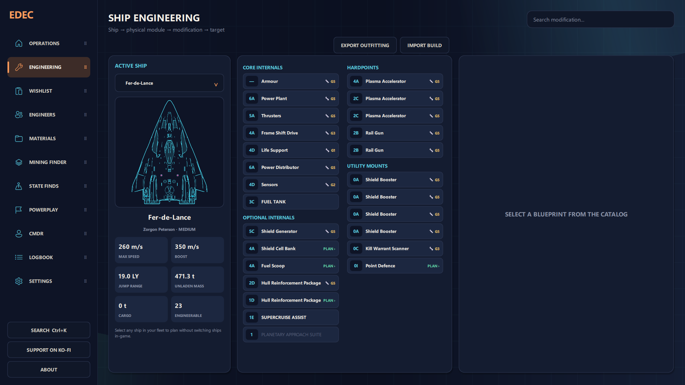
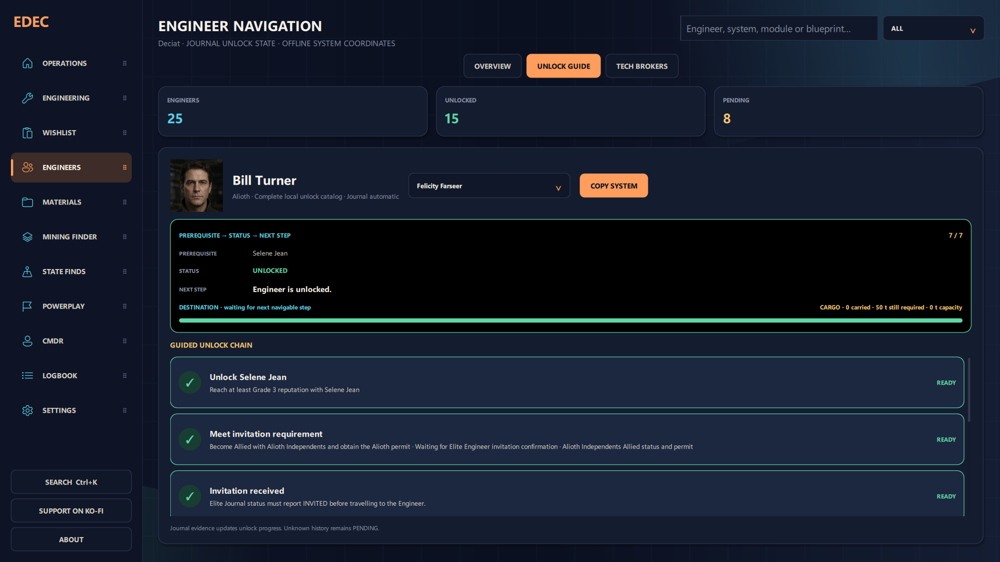
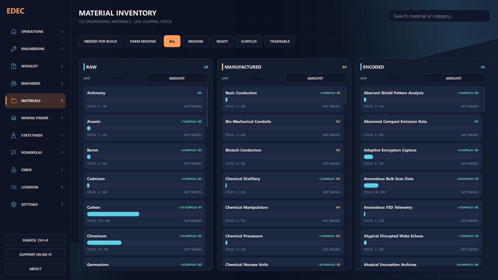
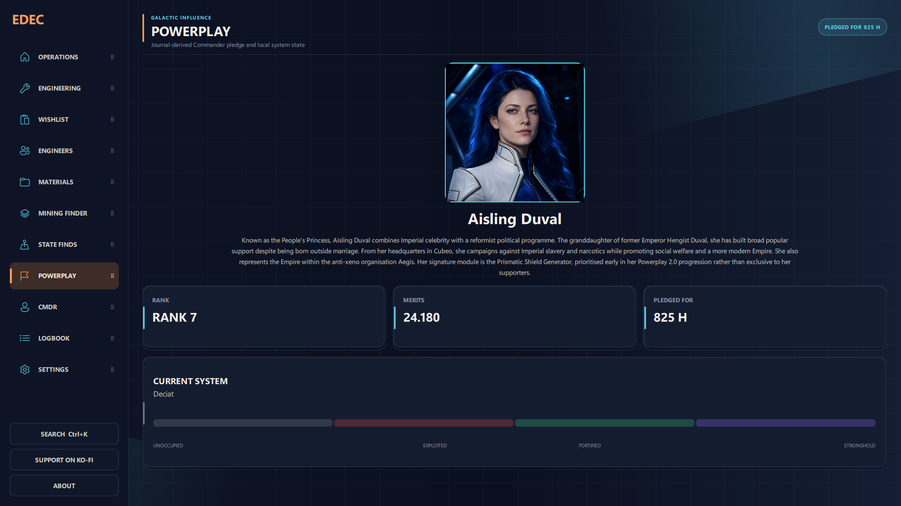
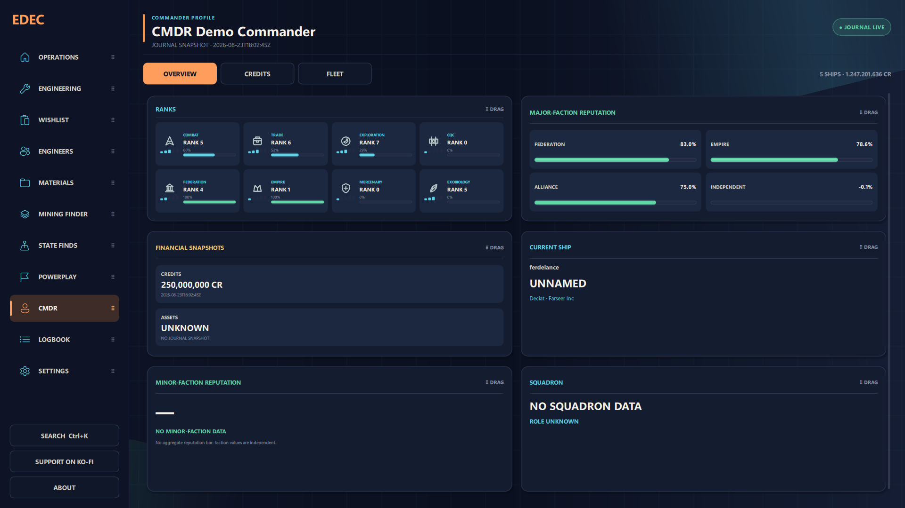
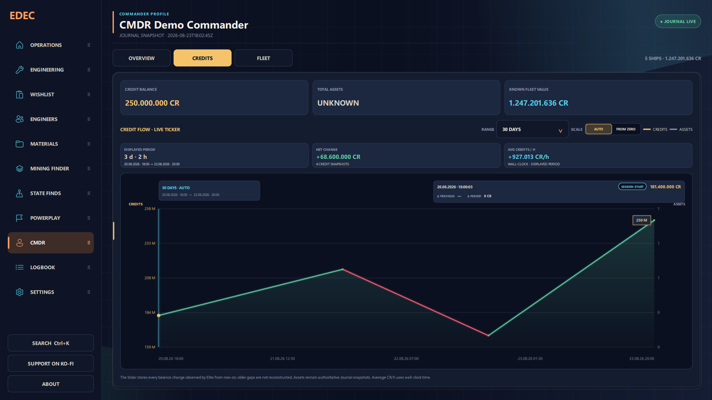
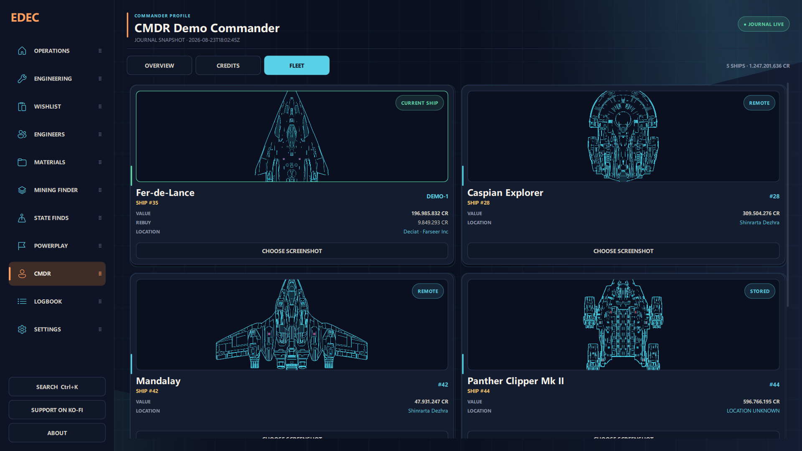
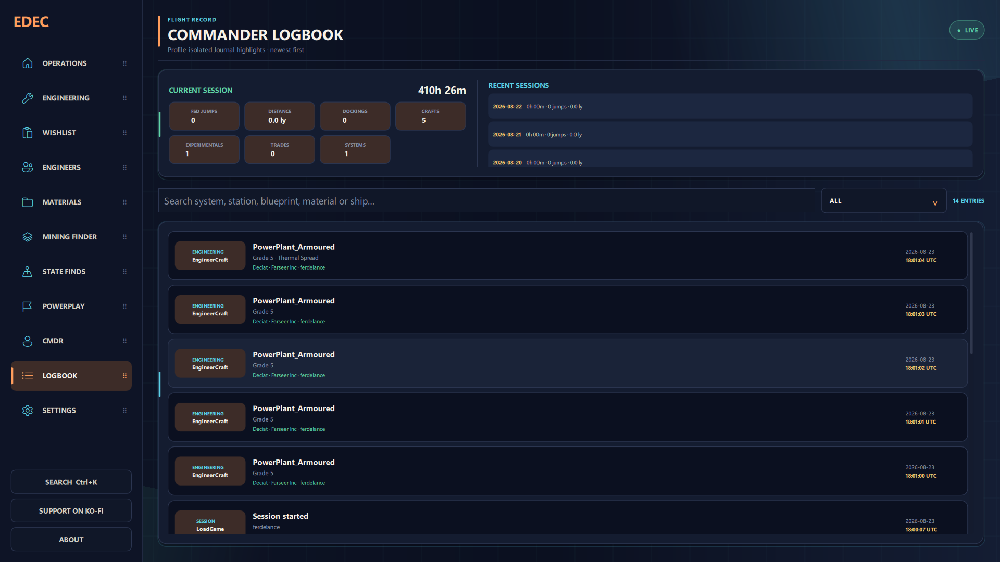
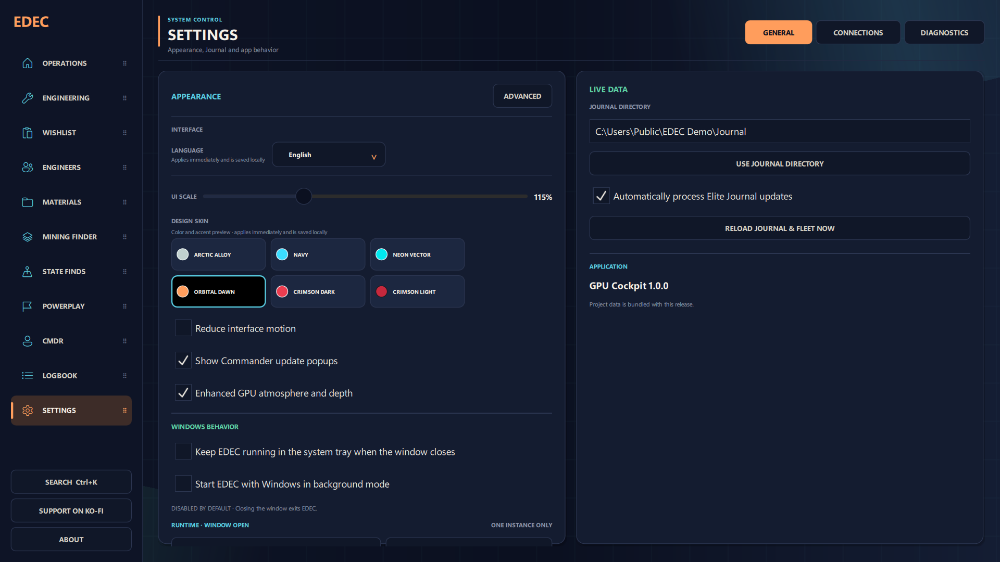

# ED Engineering Companion

**Plan Elite Dangerous engineering against the real slots of your real ships — without leaving the cockpit.**

[](https://github.com/CMDRForcer/ED-Engineering-Companion/releases/latest)
[](https://github.com/CMDRForcer/ED-Engineering-Companion/releases)
[](LICENSE)


ED Engineering Companion (EDEC) is a free, open-source Windows companion for [Elite Dangerous](https://www.elitedangerous.com/). It reads your local Journal and turns it into a ship-aware engineering workspace: every hull in your fleet, every physical module slot, every Journal-confirmed blueprint and experimental effect, and a running "what to do next" that never asks you to swap ships in-game to find out.

[**Download v1.0.1**](https://github.com/CMDRForcer/ED-Engineering-Companion/releases/latest) · [Changelog](CHANGELOG.md) · [Report a bug](https://github.com/CMDRForcer/ED-Engineering-Companion/issues) · [Support EDEC on Ko-fi](https://ko-fi.com/cmdrforcer)



## Highlights

- **Your ships, not ship types** — plan on the exact physical slots of every hull EDEC has seen in your fleet, without switching to it in-game.
- **Install-before-engineering guard** — EDEC never pretends an empty slot is ready; if the planned module isn't fitted, it says so and pauses the plan.
- **The Journal is the source of truth** — confirmed blueprints, grades and experimental effects sit on the module they belong to. Nothing is invented to fill a gap.
- **One next action, always on screen** — collect these materials, fly to this Engineer, craft this grade.
- **Material intelligence** — live Raw / Manufactured / Encoded stock, protected build reserves, verified acquisition routes, nearest-vs-Journal trader choice.
- **Engineer & Tech Broker navigation** — capability search, Journal-backed unlock progress, guided prerequisite chains, Human & Guardian broker tracking.
- **Powerplay 2.0, honestly** — pledged leader, rank, merits, salary and system state, showing only values EDEC has actually observed.
- **Safe build interchange** — import and export EDEC, EDSY/SLEF and Coriolis builds with physical slot identities intact.
- **Commander tools** — live Credits ticker and finance timeline, Logbook, State Finds, live High-Grade Emission assistance.
- **Offline-first and private** — everything runs from local files; optional INARA and EDDN sync is opt-in, rate-limited and privacy-filtered.

## Why EDEC

Most build tools model a *type* of ship. EDEC models *your* ship — the specific hull with the specific ShipID, its exact Core Internal, Optional Internal, Hardpoint, Utility Mount and Limpet/Controller layout, and the modules currently bolted into it according to your latest `Loadout` and `EngineerCraft` events.

That precision is the whole point:

- A plan stays attached to the **slot**, so two identical Multi-cannons never get confused with each other.
- Engineering that Elite has already confirmed shows up **on the module it belongs to** — grade, blueprint, experimental effect.
- If a planned module isn't actually installed, EDEC says **install it first** instead of pretending the slot is ready.
- You can plan for a ship parked on the other side of the bubble **without switching to it**.

Everything is derived from local files. Nothing is invented to fill a gap.

## A tour of EDEC

### Ship engineering, bound to real slots

Pick any ship EDEC has seen in your Journal and work on its actual physical layout — Core Internal, Optional Internal, Hardpoint, Utility Mount, Limpet/Controller. Each slot shows the module fitted there, its Journal-confirmed grade and experimental effect (`G1`–`G5`), and whether a planned change still needs the module **installed first** (`INSTALL`). Ship stats update as you plan. Pinned plans stay attached to the slot even while you browse other catalog blueprints.


The **Wishlist** turns those pinned plans into one running answer to "what now?": collect these materials, fly to this Engineer, craft this grade — or install this module before anything else.

### Engineer unlocks, step by step

A searchable index of every Engineer — capabilities, distance, and Journal-backed unlock state. The **Unlock Guide** turns a locked Engineer into an ordered checklist: prerequisite Engineer, reputation and permit requirements, invitation, first visit. Journal evidence ticks steps off as you meet them; nothing unknown is guessed. Human and Guardian Technology Brokers get the same treatment on their own tab.



### Material intelligence

Live Raw / Manufactured / Encoded inventory straight from the Journal, with per-grade caps, stock bars and surplus flags. Build reserves are protected so a plan can't spend materials it still needs; the rest is offered for trading. Filter to what a build needs, what's missing, what's ready, or what's tradeable, and route material runs by nearest-known or Journal-confirmed trader.



### Powerplay 2.0, honestly

Derived entirely from local Journal events. EDEC picks your pledged leader automatically and shows an offline profile and portrait alongside only the values it has actually observed — rank, merits, pledge duration, salary, cargo activity, system-control state. No fabricated rewards, no invented numbers.



### Commander overview

Ranks and progress, major- and minor-faction reputation, financial snapshots, current ship and squadron — read from the Journal and laid out as cards you can rearrange.



### Credits — a live ticker, not a guess

Rising balance segments are green, spending is red, total assets track alongside as a thin line. Pick a period from the current session to 30 days and EDEC reports net change, average credits per hour, and the delta on any point you hover. Old gaps aren't fabricated — the ticker gets denser as Elite reports real balance changes.



### Fleet

Every ship EDEC has seen — value, rebuy and where each one is parked (here, stored, or remote) — with the current hull marked. This is the same fleet you plan engineering against, without switching in-game.



### Flight record

A profile-isolated logbook: session totals for jumps, distance, dockings, crafts and trades, plus a searchable, filterable timeline of engineering, travel and trade events — newest first.



### Safe build interchange

Import EDEC, EDSY/SLEF and Coriolis builds through exact hull-slot validation. Export the selected ship's outfitting with its physical slot identities intact.

### Optional community connections

Rate-limited INARA synchronization and privacy-filtered EDDN contributions, both with offline-aware queues and retry handling. Off by default; you opt in per service. State Finds, live High-Grade Emission assistance and configurable navigation round out the toolkit.

### Make it yours

Six built-in themes, a UI scale, and four interface languages — English, German, Spanish and French. In-game names stay in English where that makes them easier to find in Elite.



> All screenshots use the **Orbital Dawn** theme and synthetic demo data. They contain no real Commander profile, Journal history, service credentials, or API keys.

## Install on Windows

**Requirements:** Windows 10 or 11, and Elite Dangerous Journal files for live Commander data.

### Portable (recommended)

1. Open the [latest release](https://github.com/CMDRForcer/ED-Engineering-Companion/releases/latest).
2. Under **Assets**, download `EDEC-<version>-Windows.zip`.
3. Extract the whole ZIP to a writable folder.
4. Run `EDEC.exe`, keeping the `_internal` folder beside it.

The Windows package bundles its runtime and is Explorer-compatible. A full project archive and `SHA256SUMS.txt` are published alongside it. Windows SmartScreen may warn because the executable is not code-signed.

### From source

Install Python 3, clone the repository, run `INSTALL_REQUIREMENTS.bat` once, then launch `START_APP.bat`.

Personal settings, Journal cursors, caches, plans and service credentials live outside the program directory and are never included in release archives.

## Data and privacy

EDEC works locally from Elite Dangerous Journal files. Every network integration is optional and opt-in:

- **INARA** — supported Commander events are batched, deduplicated, rate-limited, and written to local receipts before any upload.
- **EDDN** — supported public market, station, exploration and exobiology messages are validated and stripped of private or unsupported fields before transmission.
- **Frontier Companion API** — an explicit in-app consent tick is required before the first login. Authorisation uses Frontier's PKCE OAuth flow with no client secret; only credits and the active ship are imported, and newer Journal values always stay authoritative. OAuth tokens are encrypted for the current Windows account (DPAPI) and are never written to logs.
- **Spansh** — optional read-only catalog data assists navigation and material guidance, with bundled offline fallbacks.

A build run from a source checkout identifies itself to INARA and EDDN as a development build, so ad-hoc runs are never counted as a released version.

The bundled Frontier OAuth client covers the default GitHub Pages redirect. If you run your own instance and have accepted the Frontier developer terms, set `EDEC_FRONTIER_CLIENT_ID` (and, if needed, `EDEC_FRONTIER_REDIRECT_URI`) to use your own registered client.

## Reliability

- A headless load of the real `Main.qml` in CI whose QML runtime errors fail the build, plus state-based QML interaction tests.
- Contract tests for physical slot binding, EDEC/EDSY/Coriolis interchange, Powerplay observation boundaries, and external-service safety limits.
- Atomic local persistence with corruption quarantine, bounded history, multi-process protection, retry backoff, and durable queues.
- Journal processing that follows recently active files without replaying known lines.
- Translation contracts that keep the EN/DE/ES/FR catalogs and their placeholders in sync.

The full test suite and a source/packaged smoke test run on every release.

## Development

```text
INSTALL_REQUIREMENTS.bat
START_APP.bat
```

See [`requirements.txt`](requirements.txt) for runtime dependencies. EDEC is under active development; bug reports, translations and feature suggestions are welcome through [GitHub Issues](https://github.com/CMDRForcer/ED-Engineering-Companion/issues).

## License and attribution

EDEC is licensed under the [GNU General Public License v3.0](LICENSE) and is free to use.

ED Engineering Companion is an independent third-party project and is not affiliated with Frontier Developments. Elite Dangerous is a trademark of Frontier Developments plc.

Exobiology reference data (`ed_data/exobiology_species.json`, `ed_data/exobiology_colony_ranges.json`) is EDEC's own re-expression of public game facts — spawn conditions, credit values and colony-range distances — not copied code. The colony-range distances are sourced from the [Elite Dangerous Fandom wiki](https://elite-dangerous.fandom.com/wiki/Exobiology_Sample_Values_and_Details) (CC BY-SA).
