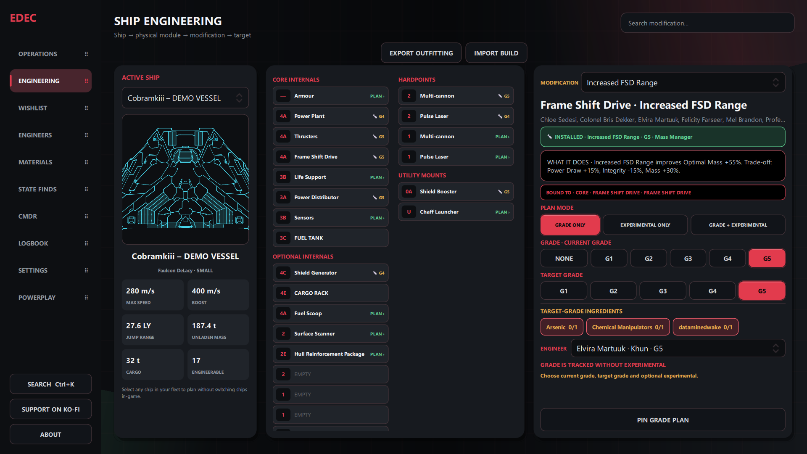
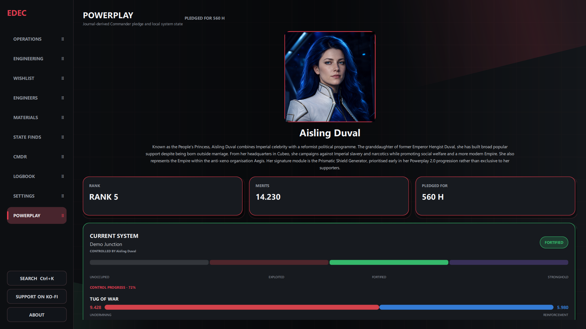
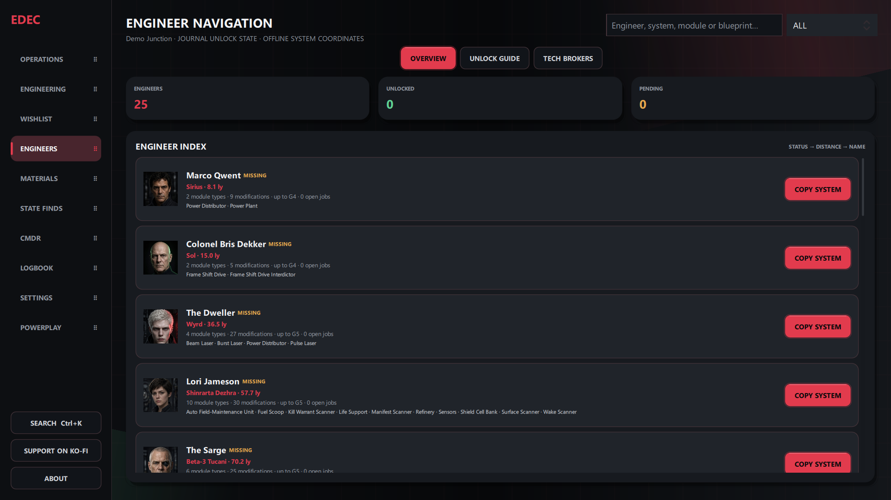

# ED Engineering Companion (EDEC)

ED Engineering Companion is a free, open-source Windows companion for **Elite Dangerous**. It turns local Journal data into a ship-aware engineering workspace: inspect the exact slots of any ship in your fleet, plan upgrades on physical module instances, track materials, choose Engineers, and follow the next useful action without changing ships in-game.

[Download the latest release](https://github.com/CMDRForcer/ED-Engineering-Companion/releases/latest) · [Changelog](CHANGELOG.md) · [Report a bug](https://github.com/CMDRForcer/ED-Engineering-Companion/issues) · [Support EDEC on Ko-fi](https://ko-fi.com/cmdrforcer)



## Highlights

- **Slot-based ship engineering:** every supported hull uses its own Core Internal, Optional Internal, Hardpoint, Utility Mount, and Limpet/Controller layout.
- **Fleet-wide planning:** select any known ship for planning without switching to it in Elite Dangerous.
- **Installed engineering awareness:** Journal-confirmed blueprints, grades, and experimental effects appear directly on their physical module slots.
- **Safe build interchange:** import EDEC, EDSY/SLEF, and Coriolis builds through exact hull-slot validation; export the selected ship's outfitting with its physical slot identities intact.
- **Actionable Wishlist:** material readiness, craft progress, Engineer destinations, and trader routes are derived from the selected ship and its pinned plans.
- **Material intelligence:** live Raw, Manufactured, and Encoded inventory, protected build stock, verified acquisition guidance, and selectable nearest-vs-Journal-confirmed trader routing.
- **Engineer navigation:** searchable Engineer capabilities, Journal-backed unlock state, guided prerequisite chains, and Human/Guardian Technology Broker tracking.
- **Powerplay 2.0:** local leader portraits and biographies, pledge duration, rank, merits, salary, cargo activity, and observed system state without inventing unavailable values.
- **Commander tools:** CMDR overview, Logbook sessions and notes, State Finds, live HGE assistance, configurable navigation, and persistent interface settings.
- **Four interface languages:** English, German, Spanish, and French. In-game names remain in English where that makes them easier to find in Elite Dangerous.
- **Optional community connections:** rate-limited INARA synchronization and privacy-filtered EDDN contributions, both with offline-aware queues and retry handling.

## Current interface

### Ship Engineering

Engineering is bound to the selected ship's actual physical slots. The module wrench and grade come from the latest authoritative Loadout and EngineerCraft Journal events; plans remain attached to the slot even when the Commander later views another catalog blueprint.

### Powerplay

The Powerplay page is derived entirely from local Journal events. It selects the pledged leader automatically, presents an offline profile and portrait, and shows only rank, merits, pledge duration, salary, cargo, and system-control values that EDEC has actually observed. Historical signature modules are described as prioritised Powerplay 2.0 unlocks rather than exclusive rewards; Nakato Kaine is represented by her trade and mining focus.



### Engineer Navigation

The Engineer area combines a capability index with unlock guidance and Technology Broker plans. Entries are ordered by state, distance, and name, while Journal evidence updates unlock progress without guessing unknown history.



All screenshots use the **Crimson Dark** theme and synthetic demo data. They contain no real Commander profile, Journal history, service credentials, or API keys.

## Download and install on Windows

### Requirements

- Windows 10 or Windows 11
- Elite Dangerous Journal files for live Commander data

### Portable installation (recommended)

1. Open the [latest EDEC release](https://github.com/CMDRForcer/ED-Engineering-Companion/releases/latest).
2. Under **Assets**, download `EDEC-<version>-Windows.zip`.
3. Extract the complete ZIP to a writable folder.
4. Start `EDEC.exe` and keep the `_internal` folder beside it.

The Windows package is Explorer-compatible and includes the required runtime. A full project archive and `SHA256SUMS` are published alongside it. Windows SmartScreen may warn because the executable is not currently code-signed.

### Run from source

Install Python 3, clone or extract the repository, run `INSTALL_REQUIREMENTS.bat` once, and then launch `START_APP.bat`.

Personal settings, Journal cursors, caches, plans, and service credentials are stored outside the program directory and are not included in release archives.

## Data and privacy

EDEC works locally from Elite Dangerous Journal files. Network integrations are optional:

- **INARA:** supported Commander events are batched, deduplicated, rate-limited, and recorded with local receipts before optional upload.
- **EDDN:** supported public market, station, exploration, and exobiology messages are validated and stripped of private or unsupported fields before transmission.
- **Spansh:** optional read-only catalog data assists navigation and material guidance, with bundled/offline fallbacks when unavailable.

The existing illustrated manuals cover release 21.164 and remain available in [English](docs/EDEC_User_Manual_Privacy_EN_21.164.pdf) and [German](docs/EDEC_User_Manual_Privacy_DE_21.164.pdf). The README and [changelog](CHANGELOG.md) describe the newer interface and behavior.

## Reliability

- State-based QML smoke tests whose runtime errors fail the test run
- Contract tests for physical slot binding, EDEC/EDSY/Coriolis interchange, Powerplay observation boundaries, and external-service safety limits
- Atomic local persistence, bounded history, multi-process protection, retry backoff, and durable queues
- Journal processing that follows recently active files without replaying known lines
- Translation contracts that keep EN/DE/ES/FR catalogs and template placeholders synchronized

## Development

Install dependencies and start the source build with:

```text
INSTALL_REQUIREMENTS.bat
START_APP.bat
```

See [`requirements.txt`](requirements.txt) for runtime dependencies. EDEC is under active development; contributions, bug reports, translations, and feature suggestions are welcome through [GitHub Issues](https://github.com/CMDRForcer/ED-Engineering-Companion/issues).

## License and attribution

EDEC is licensed under the [GNU General Public License v3.0](LICENSE) and remains free to use.

ED Engineering Companion is an independent third-party project and is not affiliated with Frontier Developments. Elite Dangerous is a trademark of Frontier Developments plc.
